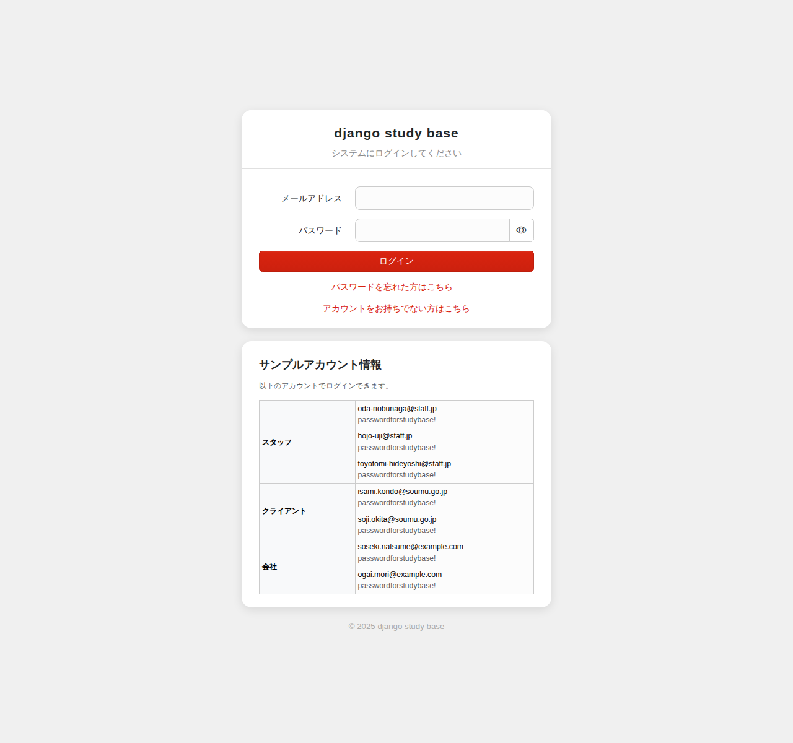
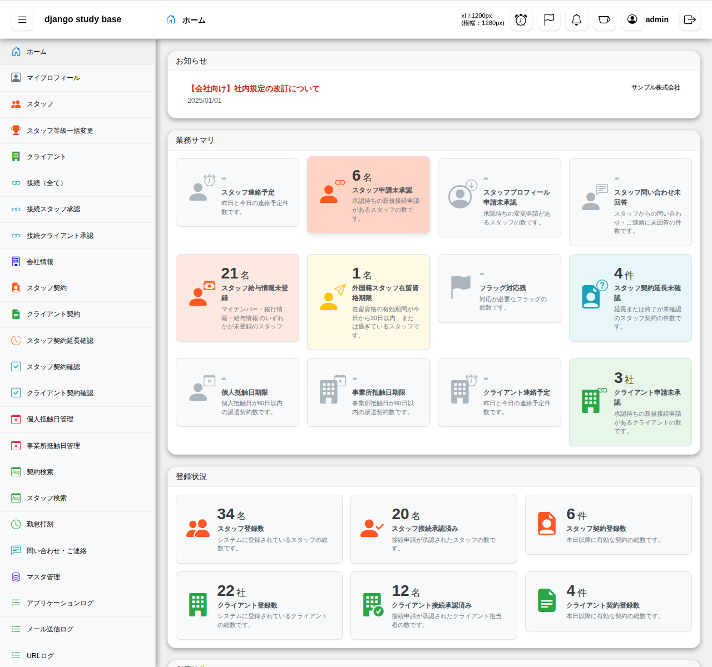
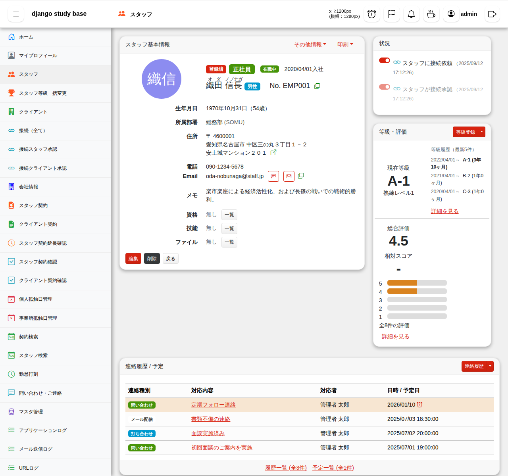
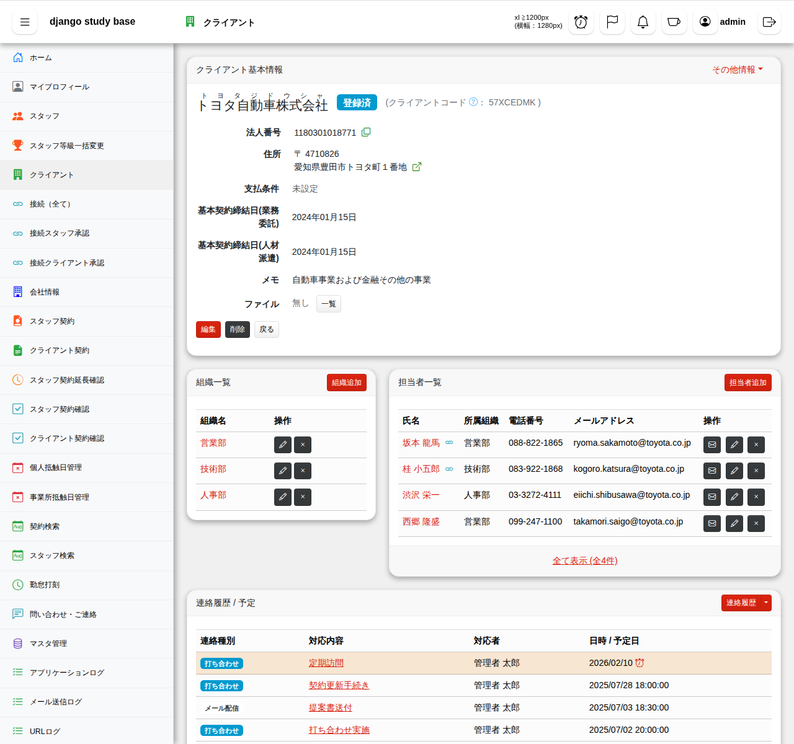
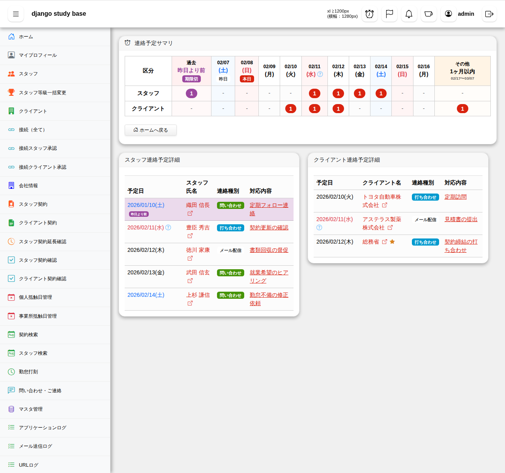
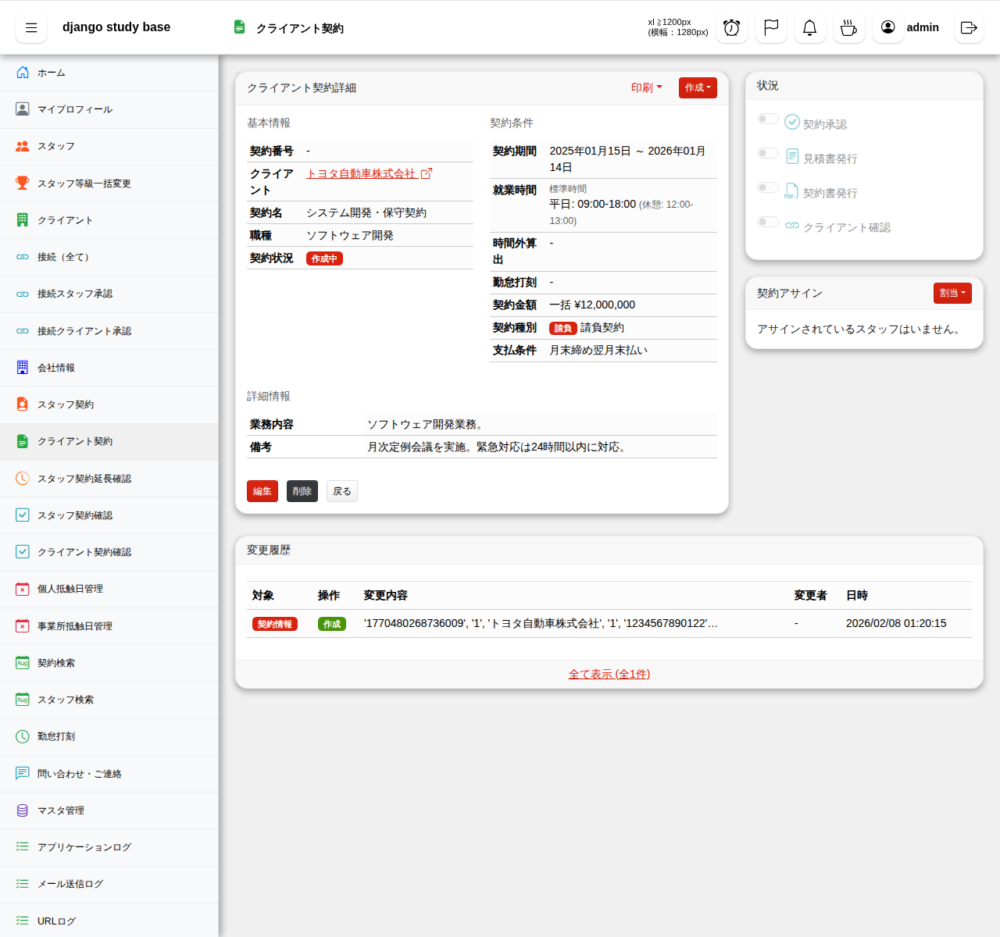
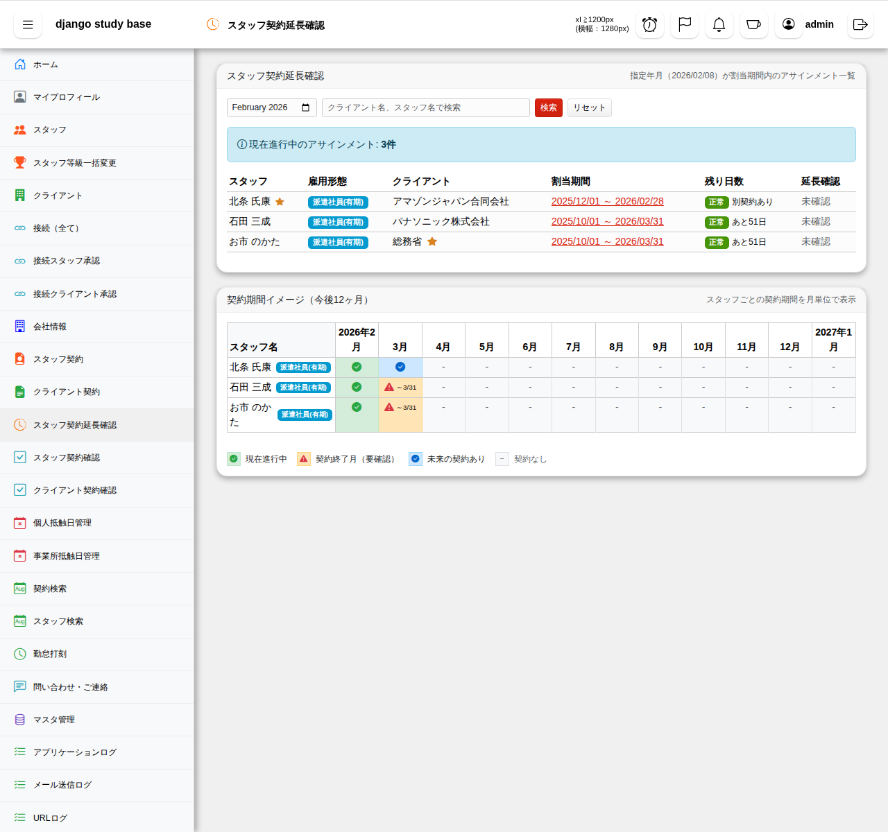
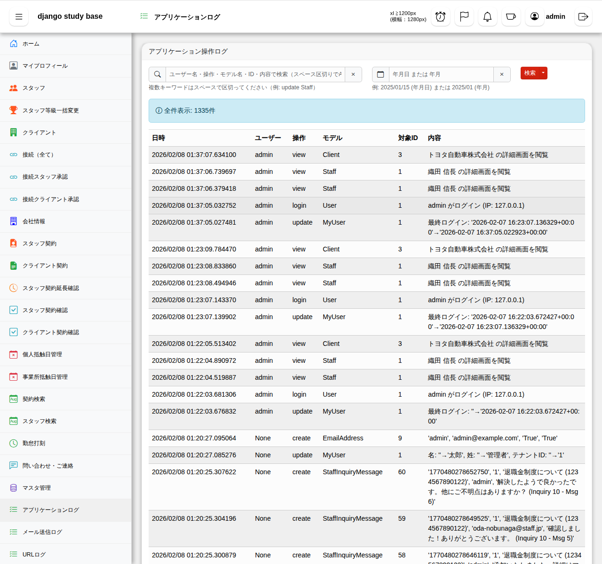

# システム画面イメージ

このドキュメントでは、システムの主要な画面イメージを紹介します。

## 1. ログイン画面
システムへの入り口となるログイン画面です。

## 2. ダッシュボード（ログイン後）
ログイン後のメイン画面です。各種統計情報や業務サマリ、お知らせが表示されます。

## 3. スタッフ詳細画面
スタッフの基本情報、連絡先、保有資格、スキルなどの詳細情報を管理します。

## 4. クライアント詳細画面
クライアント（顧客）の基本情報、組織（部署）、担当者情報を管理します。

## 5. 連絡予定サマリ
スタッフやクライアントとの次回連絡予定を一覧で確認できます。

## 6. スタッフ契約詳細
スタッフとの雇用契約内容を管理します。

## 7. クライアント契約詳細
クライアントとの取引契約（基本契約、個別契約）を管理します。

## 8. スタッフ契約延長確認
契約終了が近いスタッフの契約延長または終了の確認状況を管理します。

## 9. マスタ管理
システムで使用する各種マスタデータ（資格、スキル、銀行、支払条件など）を一元管理します。

## 10. アプリケーションログ
システム内で行われた各種データの作成・更新・削除の履歴を確認できます。

